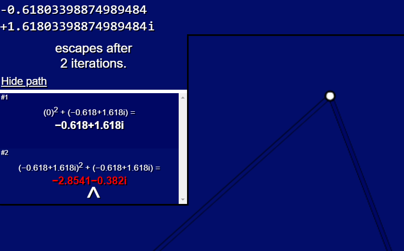
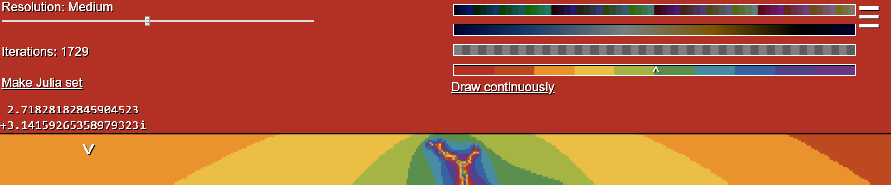

# The Interactive Mandelbrot Set
A user-friendly, satisfying view of the Mandelbrot set fractal, with:
* Smooth drag-and-drop navigation
* Paths of the iterating function fc(z)
* Julia sets
* A customizable palette
* Support for mobile devices and touchscreens

## What is the Mandelbrot set?

<b>Complex numbers</b>

To understand what the Mandelbrot set is, it's important to first understand the numbers that make it up. These numbers, called
**complex numbers**, are a little different from the usual "normal" numbers. They can be defined as the sum of two parts:

1. The *real part*, which can be any "normal" number, including whole numbers (7), fractions (&frac12;), irrationals (&pi;) and so on.

2. The *imaginary part*, which, again, can be any "normal" number, except always multiplied by the square root of -1.

The imaginary part is the confusing bit. There seemingly isn't any number which can be the square root of -1, that is, be equal to -1
when multipled by itself, since any positive number times itself is positive, and any negative number times itself is also positive, right?
But the key here is to ignore that fact and simply pretend that such a number exists, even though it's counterintuitive. We call
this number the **imaginary unit**, or **i**.

An example of a complex number is the number *2 + 3i*. The real part, in this case, is simply *2*, while the imaginary part is *3i*,
or three times the imaginary unit.

To represent these numbers like we would on a number line, we must not only use a horizontal axis, but also a vertical one, to represent
the imaginary part of the numbers. Combining the two axes, we get a two-dimensional plane, which we call the **complex plane**.

<b>The Mandelbrot set</b>

At its core, the Mandelbrot set may be defined as the collection of all complex numbers with a certain special property, explained below:

Let's create a function called f(z). Its input will be *z*, which is some complex number, and its output will be equal to
> z2 + c

c is another complex number, but it is not an input; instead it's some constant that we can change as we wish.

If we plug the number 0 into f(z), it's quite clear that the value we will get is c:
> f(0) = 02 + c = 0 + c = c

Next, let's plug that value once again into f(z):
> f(c) = c2 + c

And do it again:
> f(c2 + c) = (c2 + c)2 + c = c4 + 2c3 + c2 + c

And again:
> f(c4 + 2c3 + c2 + c) = (c4 + 2c3 + c2 + c)2 + c =
c8 + 4c7 + 6c6 + 6c5 + 5c4 + 2c3 + c2 + c

It's a little difficult to see where these values are going without plugging in actual values, so let's try a few simple numbers.
For c = 2, the sequence looks like this:
> f(0) = 02 + 2 = 2
>
> f(2) = 22 + 2 = 4 + 2 = 6
>
> f(6) = 62 + 2 = 36 + 2 = 38
>
> f(38) = 382 + 2 = 1,444 + 2 = 1,446

And so on. Without plugging in any more values, we can already see that these values will just get bigger and bigger,
generally going towards infinity.

For c = -1, however, the sequence is different:
> f(0) = 02 + (-1) = 0 + (-1) = -1
>
> f(-1) = (-1)2 + (-1) = 1 + (-1) = 0
>
> f(0) = 02 + (-1) = 0 + (-1) = -1
>
> f(-1) = (-1)2 + (-1) = 1 + (-1) = 0
>
> f(0) = 02 + (-1) = 0 + (-1) = -1

Now, the values just jump between 0 and -1 over and over, not really going anywhere. This is the special property that numbers in
the Mandelbrot set exhibit: if the sequence that the function f(z) = z2 + c produces when its values are plugged into itself
again and again remains bounded, that is, it does not get bigger and bigger, it is inside of the Mandelbrot set.

As I've said before, the Mandelbrot set is made up of complex numbers, so let's try plugging some of those in.

<b>How to work out the complex arithmetic</b>

In order to square a complex number, as the function requires, we simply work it out algebraically. For any complex number a + bi:
> (a + bi)2 = a2 + 2abi + b2i2

Since i is the square root of -1, we can replace i2 with just -1:
> a2 + 2abi + b2i2 = a2 + 2abi - b2

Which we can simplify down to a new complex number:
> (a2 - b2) + (2ab)i

Finally, to add a complex number to another complex number, we just add the real parts together and the complex parts together:

> (a2 - b2) + (2ab)i + (a + bi) = (a2 - b2 + a) + (2ab + b)i

&nbsp;

For example, c = 2 + 3i:
> f(0) = 02 + 2 + 3i = 2 + 3i
>
> f(2 + 3i) = (2 + 3i)2 + 2 + 3i = -3 + 15i
>
> f(-3 + 15i) = (-3 + 15i)2 + 2 + 3i = -214 - 87i
>
> f(-214 - 87i) = (-214 - 87i)2 + 2 + 3i = 38229 + 37239i

Again, these values just grow bigger and bigger, occasionally becoming negative, although since we're looking at the absolute value
of these numbers, growing towards negative infinity should be regarded the same as growing towards positive infinity.

But if, say, c = 0.2 + 0.3i:
> f(0) = 02 + 0.2 + 0.3i = 0.2 + 0.3i
>
> f(0.2 + 0.3i) = (0.2 + 0.3i)2 + 0.2 + 0.3i = 0.15 + 0.42i
>
> f(0.15 + 0.42i) = (0.15 + 0.42i)2 + 0.2 + 0.3i = 0.0461 + 0.426i
>
> f(0.0461 + 0.426i) = (0.0461 + 0.426i)2 + 0.2 + 0.3i = 0.02064921 + 0.3392772i

It's a little less certain than when c was -1, but if we plot these points on the complex plane, we actually get a spiral:

</img>

So we can conclude quite confidently that when c = 0.2 + 0.3i, the sequence does not grow to infinity. Therefore, 0.2 + 0.3i belongs
to the Mandelbrot set.

As it turns out, the Mandelbrot set does not contain just a few numbers; it contains infinitely many numbers. That is, there are infinitely
many values of c for which the sequence does not grow to infinity. There are also infinitely many values of c for which the sequence
*does* grow to infinity. The key is that the values in the Mandelbrot set happen to all lie within one connected and beautiful fractal,
which, when plotted on the complex plane, looks more or less like this:

</img>

<b>Julia sets</b>

A Julia set is another set of complex numbers, but its definition is different than that of the Mandelbrot set. Instead of having the variable c be any of the numbers
on the complex plane, c is now some fixed constant that is the same for every point on the plane, and instead of beginning all the sequences from 0, each sequence will
begin with a different complex number on the plane.

## How to use
Click/tap and drag the screen to navigate the complex plane. Use the mouse wheel (or pinch) to zoom in and out.
Keyboard keys may also be used (WASD, arrow keys, plus/minus); hold Shift to accelerate movement.

A white pointer can be moved about the screen, with a configurable coordinate at the top-left corner indicating its position on the plane.
The pointer may be locked or unlocked in place at any moment by right-clicking (or lightly tapping the screen); this will allow you to
view the path of the coordinate's function and its graphical representation on the plane.

</img>

Settings can be accessed by clicking the icon at the top-right corner; here, you may configure the resolution of the generated image and the
maximum number of iterations for the site to calculate, as well as generate a Julia set from the coordinate of the pointer (this can also be done by pressing J).

You can also choose the palette of your liking from the 3 default options,
or upload a special image file from your PC to be used as a palette (first row from the top is read from left to right).
Below the palettes is an option to color the complex plane continuously or discretely.

</img>

To share or save your current screen, simply copy the page's current URL; the position and scaling parameters will be reloaded
once the link is opened again.

</img>